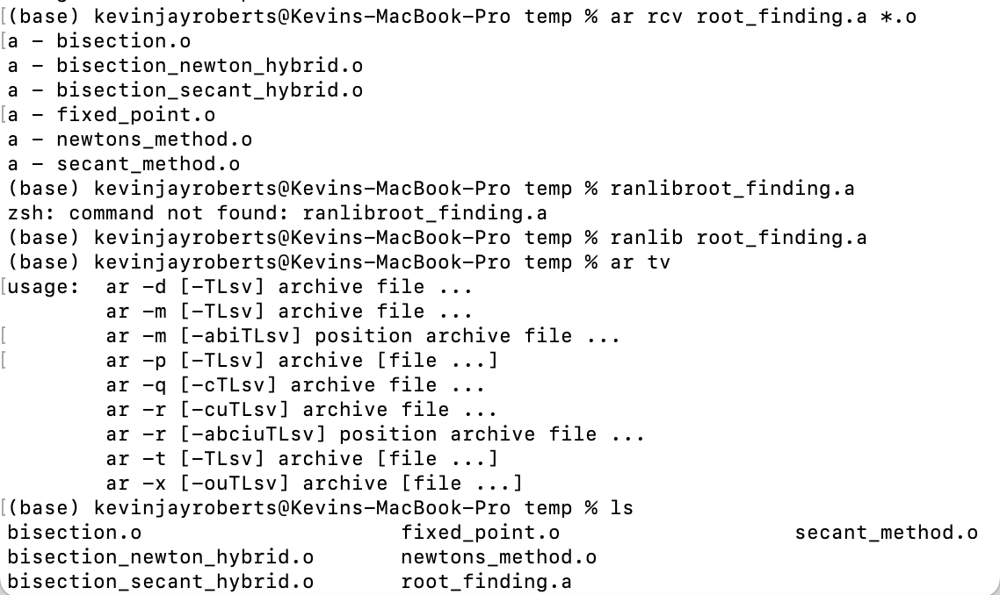
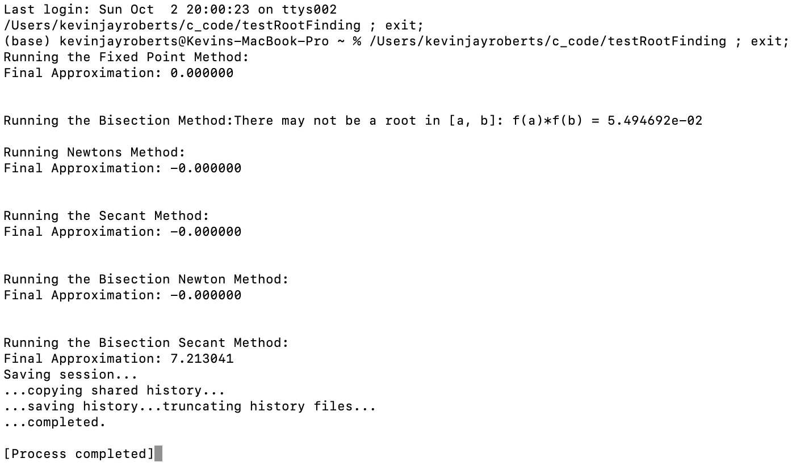

# Homework 3 

## Task 1 

I created 6 .c files for each root finding method and then created the corresponding .o files. They can be found [here](https://github.com/Kevin-Jay-Roberts21/math4610/tree/master/c_code)

## Task 2 

I created a main .c file that will run all the root finding functions. It runs Newton's Method as well as all the others. 
This file can be found [here](https://github.com/Kevin-Jay-Roberts21/math4610/blob/master/c_code/testRootFinding.c)

## Task 3 

I added the rest of the methods and ran the line in the terminal to link and load the codes: ``gcc -o testRootFinding testRootFinding.c *.o`` 

## Task 4 

I've created the shared library, and the code can be found, again, [here](https://github.com/Kevin-Jay-Roberts21/math4610/tree/master/c_code).

Here is a picture of the process:

## Task 5 

I've recompiled the code, and the testRootFinding.a file can be found in my temp folder [here](https://github.com/Kevin-Jay-Roberts21/math4610/tree/master/c_code/temp)

Here is a picture of running the testRootFinding executable:

