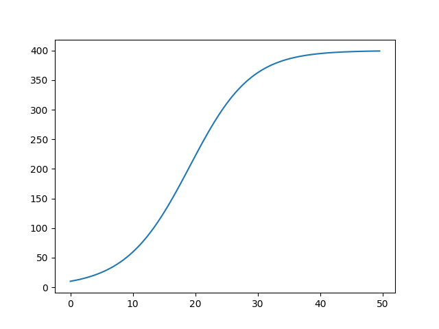
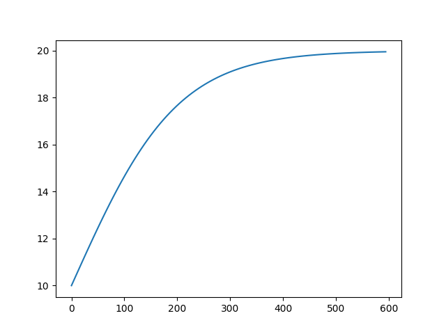
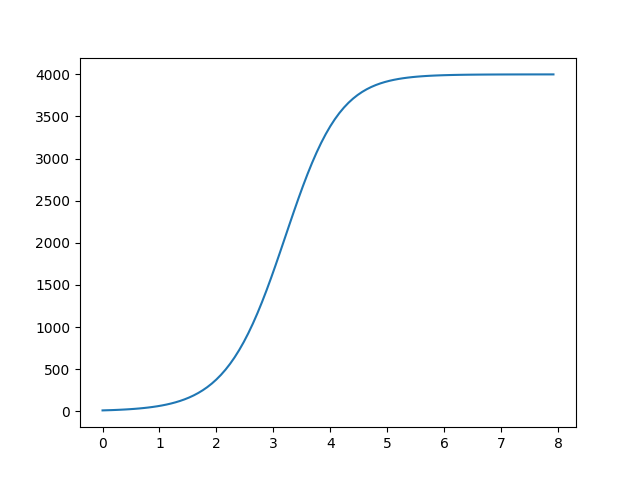
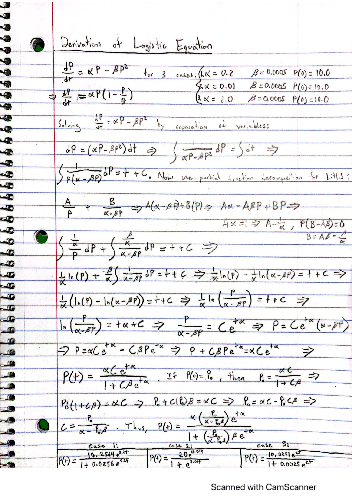
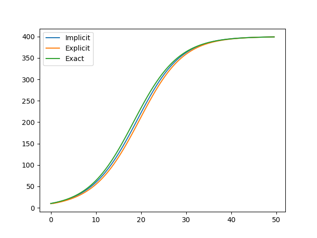
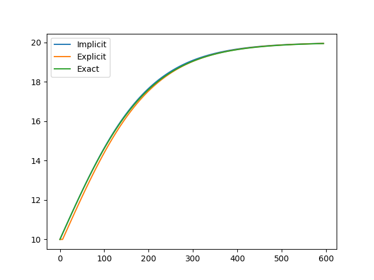
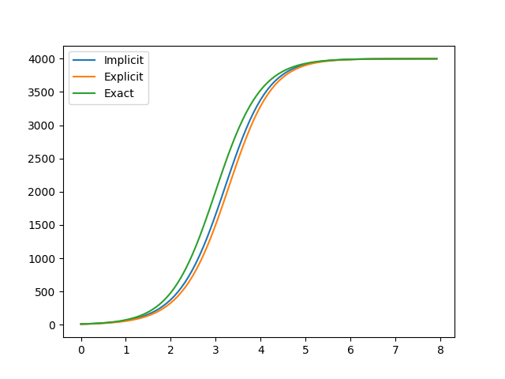
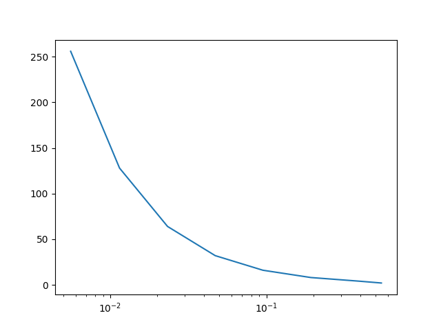

# Homework 5 
Kevin Roberts
## Task 1 

To begin this task, I called the function in my ``main.py`` file under Homework 5: 

```
a = 0.2
b = 0.0005
P0 = 10.0
first_implicit = implicit_euler_logistic(a, b, P0, 0, "a*P - b*(P*P)", 50, 100)
a = 0.01
b = 0.0005
P0 = 10.0
second_implicit = implicit_euler_logistic(a, b, P0, 0, "a*P - b*(P*P)", 600, 100)
a = 2.0
b = 0.0005
P0 = 10.0
third_implicit = implicit_euler_logistic(a, b, P0, 0, "a*P - b*(P*P)", 8, 100)
```

From the code above, we can see that I run the implicit euler function 3 times for each different condition of ``a``. The
inputs in the euler function are alpha a, beta b, initial condition P0, and initial t0 0, the logistic equation, a final 
time step T, and a number of intervals n. The corresponding printed output to the code is the following: 

```
Final Approximation: 0.12240034679439304
Final Approximation: 0.0004275008197252017
Final Approximation: 0.24597994992655003
```

Note that this is simply just what the implicit euler method prints. The method actually returns two lists: one list is 
the approximations, and the second list is the corresponding t values to those approximations. To view the graphs, we have
to do a little more in the ``main.py`` file where we call access the xvals and tvals and plot them using matplotlib: 

```
plt.plot(first_implicit[1], first_implicit[0])
plt.show()
plt.plot(second_implicit[1], second_implicit[0])
plt.show()
plt.plot(third_implicit[1], third_implicit[0])
plt.show()
```

The corresponding outputted graphs are the following: 

For ``a = 0.2``:



For ``a = 0.01``:



For ``a = 2.0``:



Finally, the code the implicit euler method is below. I initialize a time step h, tvals, xvals and the initial f0 value.
Then I proceed to use the newtons approximation method to approximate P0. Notice that I only use this once before I start
the loop because the can just use our previous P1 as our next P0 in the loop. I also had to rename variables from ``x``'s 
``P``'s and vice versa accordingly so that I could actually use the newton approximation method. The assignment said to 
use the library I created in c code. However, I decided writing the implicit method in python would be more simple and I 
can just call the newtons method here in my python code. The following method returns the approximated xvals at the corresponding
tvals. These values are then used and plotted in the ``main.py`` file.

```
def implicit_euler_logistic(a, b, P0, t0, f, T, n):

    # initialize variables
    tvals = []
    xvals = []

    h = (T - t0) / n

    P = P0
    f0 = float(eval(f))

    f = f.replace("P", "x")
    f = f.replace("a", str(a))
    f = f.replace("b", str(b))
    f_prime = "1" + " - " + str(h) + "*" + str(a) + " + 2" + "*" + str(b) + "*" + str(h) + "*x"
    f_P0 = "x" + " - " + str(h) + " * (" + f + ")" + " - " + str(P0)
    Pbar = newtons_method(f_P0, f_prime, h, 0.0001, 10)

    f = f.replace("x", "P")
    f = f.replace(str(a), "a")
    f = f.replace(str(b), "b")

    tvals.append(t0)
    xvals.append(P0)

    for i in range(1, n):
        t1 = t0 + h
        P1 = Pbar + (h * f0)
        tvals.append(t1)
        xvals.append(Pbar)
        t0 = t1
        Pbar = P1
        P = Pbar
        f0 = float(eval(f))

    print("Final Approximation: " + str(f0))
    return [xvals, tvals]
```

## Task 2 

For this task, I derived the function on paper to find the exact solution. My work can be found below: 



After I found my exact solution, I tested it on various values. The code I used to call the function for the exact solution
is the following (which can be found in my ``main.py`` file in github): 

```
a = 0.2
b = 0.0005
P0 = 10.0
exact = exact_logistic(a, b, P0, 0, "(a*(P0/(a - P0*b))*np.exp(t*a))/(1 + b*(P0/(a - P0*b))*np.exp(t*a))", 50, 100)
print("The exact value at " + str(exact[1][2]) + " is " + str(exact[0][2]))
print("The exact value at " + str(exact[1][5]) + " is " + str(exact[0][5]))
print("The exact value at " + str(exact[1][10]) + " is " + str(exact[0][10]))
```

The corresponding output is the following: 

```
The exact value at 1.0 is 12.146794237924682
The exact value at 2.5 is 16.22408990157865
The exact value at 5.0 is 26.063219378365762
```

The following is the function I wrote to compute the exact solution for the logistic equation:

```
def exact_logistic(a, b, P0, t0, f, T, n):
    # initialize variables
    tvals = []
    xvals = []

    h = (T - t0) / n

    t = 0
    f0 = float(eval(f))

    tvals.append(t0)
    xvals.append(P0)

    xi = 0
    for i in range(1, n):
        t1 = t0 + h
        xi = xi + h
        t = t1
        f0 = float(eval(f))
        tvals.append(t1)
        xvals.append(f0)
        t0 = t1

    return [xvals, tvals]
```

I created the exact function to also return a set of xvals that correspond to each of the tvals. Thus, when I called the 
exact solution in the ``main.py`` file, I can grab a certain t value and it's corresponding exact value at the t value.

## Task 3 

For this task, a lot more is happening in the ``main.py`` file. This is what I did in the ``main.py`` file: 

```
a = 0.2
b = 0.0005
P0 = 10.0
implicit1 = implicit_euler_logistic(a, b, P0, 0, "a*P - b*(P*P)", 50, 100)
explicit1 = explicit_euler_logistic(a, b, P0, 0, "a*P - b*(P*P)", 50, 100)
exact1 = exact_logistic(a, b, P0, 0, "(a*(P0/(a - P0*b))*np.exp(t*a))/(1 + b*(P0/(a - P0*b))*np.exp(t*a))", 50, 100)
a = 0.01
b = 0.0005
P0 = 10.0
implicit2 = implicit_euler_logistic(a, b, P0, 0, "a*P - b*(P*P)", 600, 100)
explicit2 = explicit_euler_logistic(a, b, P0, 0, "a*P - b*(P*P)", 600, 100)
exact2 = exact_logistic(a, b, P0, 0, "(a*(P0/(a - P0*b))*np.exp(t*a))/(1 + b*(P0/(a - P0*b))*np.exp(t*a))", 600, 100)
a = 2.0
b = 0.0005
P0 = 10.0
implicit3 = implicit_euler_logistic(a, b, P0, 0, "a*P - b*(P*P)", 8, 100)
explicit3 = explicit_euler_logistic(a, b, P0, 0, "a*P - b*(P*P)", 8, 100)
exact3 = exact_logistic(a, b, P0, 0, "(a*(P0/(a - P0*b))*np.exp(t*a))/(1 + b*(P0/(a - P0*b))*np.exp(t*a))", 8, 100)

# now we must create a plot with all 3 graphs
# use label='first plot', to label
plt.plot(implicit1[1], implicit1[0], label='Implicit')
plt.plot(explicit1[1], explicit1[0], label='Explicit')
plt.plot(exact1[1], exact1[0], label='Exact')
plt.legend()
plt.show()
plt.plot(implicit2[1], implicit2[0], label='Implicit')
plt.plot(explicit2[1], explicit2[0], label='Explicit')
plt.plot(exact2[1], exact2[0], label='Exact')
plt.legend()
plt.show()
plt.plot(implicit3[1], implicit3[0], label='Implicit')
plt.plot(explicit3[1], explicit3[0], label='Explicit')
plt.plot(exact3[1], exact3[0], label='Exact')
plt.legend()
plt.show()
```

The methods exact_logistic(), implicit_euler_logistic(), and explicit_euler_logistic() can all be found in the code appendix. 
As well as the newtons_method() function. The first 18 lines of the code above are used to create x approximations for their 
corresponding t values for the implicit, explicit and exact solutions. Once I obtain all this information, the next lines 
of code include graphing using matplotlib. The graphs I got are the following: 

For ``a = 0.2``:



For ``a = 0.01``:



For ``a = 2.0``:



Looking at how close the implicit approximation, and the explicit approximation are to the exact solution is most interesting.

## Task 4 

For this task I had computed 5 different n values: n = 2, 4, 8, 16, and 32. Know that I didn't have to compute for n = 32
however, I wanted to see what would happen if I included more partitions. In my ``main.py`` file I ran the following code: 

```
a = 0
b = np.pi/4
trapezoidal_rule("np.exp(-x*x)", a, b, 2)
# for n = 4
a = 0
b = np.pi/4
trapezoidal_rule("np.exp(-x*x)", a, b, 4)
# for n = 8
a = 0
b = np.pi/4
trapezoidal_rule("np.exp(-x*x)", a, b, 8)
# for n = 16
a = 0
b = np.pi/4
trapezoidal_rule("np.exp(-x*x)", a, b, 16)
# for n = 32
a = 0
b = np.pi/4
trapezoidal_rule("np.exp(-x*x)", a, b, 32)
```

Notice that the defined trapezoidal_rule() function takes a function f, end point a, end point b, and the number of partitions. 
The following output I get is: 

```
The final approximation is: 0.6388862805734845for n = 2
The final approximation is: 0.6471507696813964for n = 4
The final approximation is: 0.6491991053630145for n = 8
The final approximation is: 0.6497100964398593for n = 16
The final approximation is: 0.6498377761980951for n = 32
```

From the output above, it looks as though the sequence converges to about 0.6498. 

The trapezoidal function is the following: 

```
def trapezoidal_rule(f, a, b, n):
    dx = (b - a)/n
    x = b
    fxn = float(eval(f))
    x = a
    fx0 = float(eval(f))
    sum = 0.5 * (fx0 + fxn)
    xk = 0
    for k in range(1, n):
        xk = xk + (b - a) / n
        x = xk
        fxk = float(eval(f))
        sum = sum + fxk
    sum = sum * dx
    print("The final approximation is: " + str(sum) + "for n = " + str(n))
    return sum
```

## Task 5 

For this task I did something very similar to what I did for the Trapezoidal method. I had computed 5 different n values:
n = 2, 4, 8, 16, and 32. Know that I didn't have to compute for n = 32 however, I wanted to see what would happen if I 
included more partitions. In my ``main.py`` file I ran the following code: 

```
a = 0
b = np.pi/4
simpsons_rule("np.exp(-x*x)", a, b, 2)
# for n = 4
a = 0
b = np.pi/4
simpsons_rule("np.exp(-x*x)", a, b, 4)
# for n = 8
a = 0
b = np.pi/4
simpsons_rule("np.exp(-x*x)", a, b, 8)
# for n = 16
a = 0
b = np.pi/4
simpsons_rule("np.exp(-x*x)", a, b, 16)
# for n = 32
a = 0
b = np.pi/4
simpsons_rule("np.exp(-x*x)", a, b, 32)
```

Notice that the defined simpsons_rule() function takes a function f, end point a, end point b, and the number of partitions. 
The following output I get is: 

```
The final approximation is: 0.20153859920843972for n = 2
The final approximation is: 0.3526675840434031for n = 4
The final approximation is: 0.5537979268005845for n = 8
The final approximation is: 0.6515083716983154for n = 16
The final approximation is: 0.6994869133544624for n = 32
```

From the output above, it looks as though the sequence converges to about 0.6995. 

The simpsons function is the following: 

```
def simpsons_rule(f, a, b, n):
    dx = (a + b)/n
    x = b
    fxn = float(eval(f))
    x = a
    fx0 = float(eval(f))
    sum = fx0 + fxn
    xk = 0
    for k in range(1, n-2, 2):
        xk = xk + (b-a)/n
        x = xk
        fxk = float(eval(f))
        sum = sum + (4.0 * fxk)
    xk = 0
    for i in range(2, n-2, 2):
        xk = xk + (b - a)/n
        x = xk
        fxk = float(eval(f))
        sum = sum + (2.0 * fxk)
    sum = (sum * dx)/3.0
    print("The final approximation is: " + str(sum) + "for n = " + str(n))
    return sum
```

Now performing a computational convergence rate for the Simpson's rule. We desire to find an approximation for each
n = 2, 4, 8, 16, 32, 64, 128, 256. Then we need to compare these approximations to an exact value. I computed an approximate
exact value by letting n = 5000. After doing this I compared each of the approximations to my exact value and plotted them. 
My main code looks like the following: 

```
a = 0
b = np.pi/4
xvals = []
tvals = [2, 4, 8, 16, 32, 64, 128, 256]
SR_2 = simpsons_rule("np.exp(-x*x)", a, b, 2)
SR_4 = simpsons_rule("np.exp(-x*x)", a, b, 4)
SR_8 = simpsons_rule("np.exp(-x*x)", a, b, 8)
SR_16 = simpsons_rule("np.exp(-x*x)", a, b, 16)
SR_32 = simpsons_rule("np.exp(-x*x)", a, b, 32)
SR_64 = simpsons_rule("np.exp(-x*x)", a, b, 64)
SR_128 = simpsons_rule("np.exp(-x*x)", a, b, 128)
SR_256 = simpsons_rule("np.exp(-x*x)", a, b, 256)
# exact value (about)
SR_5000 = simpsons_rule("np.exp(-x*x)", a, b, 5000)
xvals.append(abs(SR_5000-SR_2))
xvals.append(abs(SR_5000-SR_4))
xvals.append(abs(SR_5000-SR_8))
xvals.append(abs(SR_5000-SR_16))
xvals.append(abs(SR_5000-SR_32))
xvals.append(abs(SR_5000-SR_64))
xvals.append(abs(SR_5000-SR_128))
xvals.append(abs(SR_5000-SR_256))

plt.xscale("log")
plt.plot(xvals, tvals)
plt.show()
```

And the corresponding outputted values and graphs are the following: 

```
The final approximation is: 0.20153859920843972for n = 2
The final approximation is: 0.3526675840434031for n = 4
The final approximation is: 0.5537979268005845for n = 8
The final approximation is: 0.6515083716983154for n = 16
The final approximation is: 0.6994869133544624for n = 32
The final approximation is: 0.7232389983736529for n = 64
The final approximation is: 0.7350536557347617for n = 128
The final approximation is: 0.7409453876509926for n = 256
The final approximation is: 0.7465257648773337for n = 5000
```



From the graph above, we can see that the error gets closer and closer to 0 as we increase the number of n intervals. From 
the numerical output, we can see that the approximation is about 0.7465.

## Code Appendix

Functions used: 

```
def exact_logistic(a, b, P0, t0, f, T, n):
    # initialize variables
    tvals = []
    xvals = []

    h = (T - t0) / n

    t = 0
    f0 = float(eval(f))

    tvals.append(t0)
    xvals.append(P0)

    xi = 0
    for i in range(1, n):
        t1 = t0 + h
        xi = xi + h
        t = t1
        f0 = float(eval(f))
        tvals.append(t1)
        xvals.append(f0)
        t0 = t1

    return [xvals, tvals]
```

```
def implicit_euler_logistic(a, b, P0, t0, f, T, n):

    # initialize variables
    tvals = []
    xvals = []

    h = (T - t0) / n

    P = P0
    f0 = float(eval(f))

    f = f.replace("P", "x")
    f = f.replace("a", str(a))
    f = f.replace("b", str(b))
    f_prime = "1" + " - " + str(h) + "*" + str(a) + " + 2" + "*" + str(b) + "*" + str(h) + "*x"
    f_P0 = "x" + " - " + str(h) + " * (" + f + ")" + " - " + str(P0)
    Pbar = newtons_method(f_P0, f_prime, h, 0.0001, 10)

    f = f.replace("x", "P")
    f = f.replace(str(a), "a")
    f = f.replace(str(b), "b")

    tvals.append(t0)
    xvals.append(P0)

    for i in range(1, n):
        t1 = t0 + h
        P1 = Pbar + (h * f0)
        tvals.append(t1)
        xvals.append(Pbar)
        t0 = t1
        Pbar = P1
        P = Pbar
        f0 = float(eval(f))

    print("Final Approximation: " + str(f0))
    return [xvals, tvals]
```

```
def explicit_euler_logistic(a, b, P0, t0, f, T, n):

    # initialize variables
    tvals = []
    xvals = []

    h = (T - t0)/n
    P = P0

    tvals.append(t0)
    xvals.append(P0)

    f0 = float(eval(f))
    for i in range(1, n):
        t1 = t0 + h
        P1 = P0 + (h * f0)
        tvals.append(t1)
        xvals.append(P0)
        t0 = t1
        P0 = P1
        P = P0
        f0 = float(eval(f))

    print("Final Approximation: " + str(f0))
    return [xvals, tvals]
```

```
def newtons_method(f, fprime, x0, tol, maxiter):
    x = x0
    f0 = float(eval(f))
    fp = float(eval(fprime))
    error = 10.0 * tol
    iter = 0

    # print("Results from Newtons Method:")
    # print("{:<25} {:<25} {:<25}".format('Iterations', 'Approx. Root Location', 'Error'))

    while (error > tol and iter < maxiter):
        if (fp == 0):
            print("Quitting because we found division by 0")
            return x0
        x1 = x0 - (f0 / fp)
        error = abs(x1 - x0)
        # print("{:<25} {:<25} {:<25}".format(iter, "{:.10f}".format(x1), "{:.10f}".format(error)))
        iter += 1
        x0 = x1
        x = x0
        f0 = float(eval(f))
        fp = float(eval(fprime))

    return x1

    print("Final Approximation: " + str(x1))
    
def trapezoidal_rule(f, a, b, n):
    dx = (b - a)/n
    x = b
    fxn = float(eval(f))
    x = a
    fx0 = float(eval(f))
    sum = 0.5 * (fx0 + fxn)
    xk = 0
    for k in range(1, n):
        xk = xk + (b - a) / n
        x = xk
        fxk = float(eval(f))
        sum = sum + fxk
    sum = sum * dx
    print("The final approximation is: " + str(sum) + "for n = " + str(n))
    return sum
    
def simpsons_rule(f, a, b, n):
    dx = (a + b)/n
    x = b
    fxn = float(eval(f))
    x = a
    fx0 = float(eval(f))
    sum = fx0 + fxn
    xk = 0
    for k in range(1, n-2, 2):
        xk = xk + (b-a)/n
        x = xk
        fxk = float(eval(f))
        sum = sum + (4.0 * fxk)
    xk = 0
    for i in range(2, n-2, 2):
        xk = xk + (b - a)/n
        x = xk
        fxk = float(eval(f))
        sum = sum + (2.0 * fxk)
    sum = (sum * dx)/3.0
    print("The final approximation is: " + str(sum) + "for n = " + str(n))
    return sum
```

