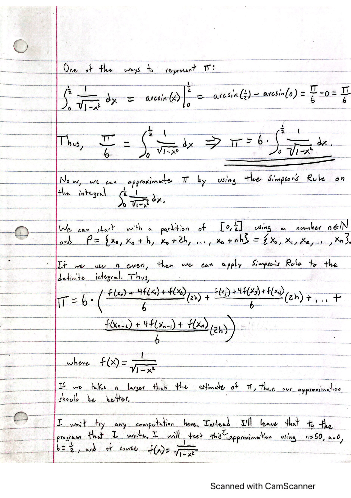
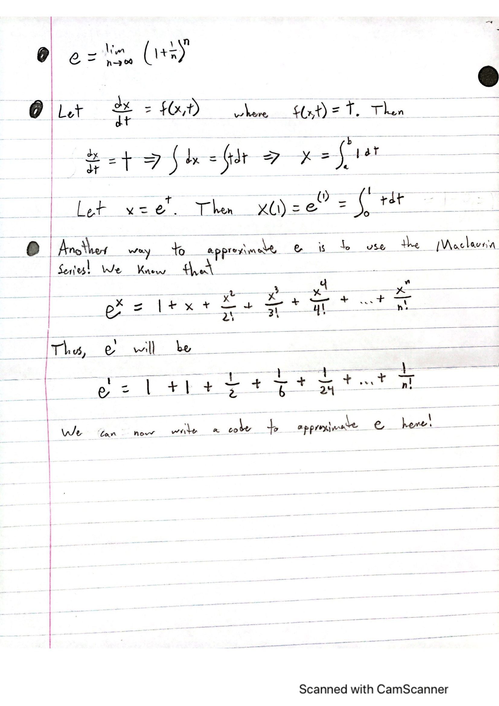

# Homework 6
By: Kevin Roberts

## Task 1 
For this task I did not write any code. Instead, I came up with a method that uses the Simpson's rule to produce an approximation
of an integral that is an approximately equivalent to pi. The image below shows my development: 



As said in the image, I'll now perform some computation in the code.

## Task 2 

For this task I initially wrote code in python to approximate pi. I used Simpson's Rule to approximate. The input I used
was the following: 

      pi_approx = my_simpsons_rule("1/(np.sqrt(1-(x*x)))", 0, 0.5, 100000)
      print("Approximation of pi using Simpson's Rule: " + str(pi_approx))
      print("Pi exact (according to computer's np accuracy): " + str(np.pi))

The corresponding output: 

      The time it took to generate pi was: 3.2172482013702393
      Approximation of pi using Simpson's Rule: 3.1415972946633595
      Pi exact (according to computer's np accuracy): 3.141592653589793

And the function I wrote for the calculation:

```python
def my_simpsons_rule(f, a, b, n):
    if (n % 2) != 0:
        return "n must be an even number for Simpson's Rule."

    start = time.time()
    h = 2 * ((b - a)/n)
    sum = 0
    x0 = (b-a)/n
    for i in range(0, int(n/2)):
        x = x0
        fx0 = float(eval(f))
        x1 = x0 + (b-a)/n
        x = x1
        fx1 = float(eval(f))
        x2 = x1 + (b-a)/n
        x = x2
        fx2 = float(eval(f))
        sum += (fx0 + 4*fx1 + fx2)*(h/3)
        x0 = x2
    end = time.time()

    totaltime = end-start
    print("The time it took to generate pi was: " + str(totaltime))
    return 3 * sum
```

This code must now be transformed into C code so that we can use openMP operations on it. In C code, I wrote the following
c code to approximate pi: 

```
#include <stdio.h>
#include <stdlib.h>
#include <math.h>
#include <time.h>

double fval(double);

static long n = 100000; 
double step; 
int main () {
    
    clock_t t;
    t = clock();

    double a = 0; double b = 0.5; int i; double x; double fx0; double fx1; double fx2; double x1; double x2;

    double h = 2 * ((b - a)/n);
    double pi = 0;
    double x0 = (b-a)/n;
    for (i=0; i < n/2; i++) {
        x = x0;
        fx0 = fval(x);
        x1 = x0 + (b-a)/n;
        x = x1;
        fx1 = fval(x);
        x2 = x1 + (b-a)/n;
        x = x2;
        fx2 = fval(x);
        pi += (fx0 + 4*fx1 + fx2)*(h/3);
        x0 = x2;
    }
    pi = pi * 3;

    t = clock() - t;
    double totaltime = ((double)t)/CLOCKS_PER_SEC;
    printf("\nThe time it took to generate pi was: %f\n", totaltime);
    printf("\nThe approximated pi: %f\n", pi);
    printf("\nThe exact value of pi: %f\n", M_PI);
}
double fval(double x){
    double fval = 1 / sqrt(1 - x*x);
    return fval; 
}
```

The output of the code above is: 

      The time it took to generate pi was: 0.003481
      The approximated pi: 3.141597
      The exact value of pi: 3.141593

Thus, already with just rewriting the approximation in c code, we can see that it's much much faster than writing the approximation
function in python. Now we are to test this using openMP.

## Task 3 

In the assignment description, it is said that we can use the code provided in the youtube tutorial, so that is what I'll
be doing here. Notice that in the video, he is using the midpoint method and I am using Simpson's Rule so approximations 
may vary slightly. The code I used to approximate pi using openMP is the following: 

```
#include <stdio.h>
#include <omp.h>
static long n = 100000; 
#define NUM_THREADS 2 
void main () 
{   int i, nthreads; double pi, sum[NUM_THREADS];
    step = 1.0/(double) n;
    omp_set_num_threads(NUM_THREADS);
  #pragma omp parallel
  {
    int i, id, nthrds; 
        double x; 
        id = omp_get_thread_num();
        nthrds = omp_get_num_threads();
        if (id == 0) nthreads = nthrds;
    for (i=id, sum[id] = 0.0; i < n; i=i+nthrds) {
        x = (i + 0.5) * step; 
        sum[id] += 4.0/(1.0 + x*x);
    }
  }
  for (i = 0, pi = 0.0; i < threads; i++)pi += sum[i] * step;
}
```

The output from this code is faster than our previous c code written in the previous problem. I know this just from watching
Tim's videos, however I was unable to get my software to recognize ``<omp.h>``, thus it didn't run (something I'll figure out in time).

## Task 4 

For this task I derived an approximation for e in the following image: 



Using the somehwat similar methods, I inputted: 

      e_approx = approximate_e(50)
      print("Approximation of e using Maclaurin Series: " + str(e_approx))
      print("e exact (according to the computer's np accuracy): " + str(math.e))

And the corresponding output, I got: 

      The time it took to generate e was: 8.392333984375e-05
      Approximation of e using Maclaurin Series: 2.7182818284590455
      e exact (according to the computer's np accuracy): 2.718281828459045

The function I wrote: 

```python
def approximate_e(n):

    sum = 0
    start = time.time()
    for i in range(0, n):
        sum += 1/(math.factorial(i))

    end = time.time()
    totaltime = end - start
    print("The time it took to generate e was: " + str(totaltime))
    return sum
```

Using the Maclaurin Series to aproximate e, I get fairly accurate approximateions in a very short amount of time.

## Task 5 

For this task I have created all the linear algebra computations in python. Below I've provided links to the software manual
pages, where the code is used, and where the functions (all created in a single module), can be found.

#### vector addition
The software manual page can be found [here](https://github.com/Kevin-Jay-Roberts21/math4610/blob/master/software_manual_templates/vector_addition.md)

The function can be found in this module [here](https://github.com/Kevin-Jay-Roberts21/math4610/blob/master/linear_algebra_operations/linear_algebra_operations.py)

The usage of the function can be found under Homework 5, under Task 5 [here](https://github.com/Kevin-Jay-Roberts21/math4610/blob/master/main.py)
#### vector subtraction
The software manual page can be found [here](https://github.com/Kevin-Jay-Roberts21/math4610/blob/master/software_manual_templates/vector_addition.md)

The function can be found in this module [here](https://github.com/Kevin-Jay-Roberts21/math4610/blob/master/linear_algebra_operations/linear_algebra_operations.py)

The usage of the function can be found under Homework 5, under Task 5 [here](https://github.com/Kevin-Jay-Roberts21/math4610/blob/master/main.py)
#### scalar multiplication of a number and a vector
The software manual page can be found [here](https://github.com/Kevin-Jay-Roberts21/math4610/blob/master/software_manual_templates/scalar_mult_of_number_and_vector.md)

The function can be found in this module [here](https://github.com/Kevin-Jay-Roberts21/math4610/blob/master/linear_algebra_operations/linear_algebra_operations.py)

The usage of the function can be found under Homework 5, under Task 5 [here](https://github.com/Kevin-Jay-Roberts21/math4610/blob/master/main.py)
#### the length or norm of a vector
##### For L1
The software manual page can be found [here](https://github.com/Kevin-Jay-Roberts21/math4610/blob/master/software_manual_templates/L1_norm_of_vector.md)

The function can be found in this module [here](https://github.com/Kevin-Jay-Roberts21/math4610/blob/master/linear_algebra_operations/linear_algebra_operations.py)

The usage of the function can be found under Homework 5, under Task 5 [here](https://github.com/Kevin-Jay-Roberts21/math4610/blob/master/main.py)
##### For L2
The software manual page can be found [here](https://github.com/Kevin-Jay-Roberts21/math4610/blob/master/software_manual_templates/L2_norm_of_vector.md)

The function can be found in this module [here](https://github.com/Kevin-Jay-Roberts21/math4610/blob/master/linear_algebra_operations/linear_algebra_operations.py)

The usage of the function can be found under Homework 5, under Task 5 [here](https://github.com/Kevin-Jay-Roberts21/math4610/blob/master/main.py)
##### For L Infinity
The software manual page can be found [here](https://github.com/Kevin-Jay-Roberts21/math4610/blob/master/software_manual_templates/Linf_norm_of_vector.md)

The function can be found in this module [here](https://github.com/Kevin-Jay-Roberts21/math4610/blob/master/linear_algebra_operations/linear_algebra_operations.py)

The usage of the function can be found under Homework 5, under Task 5 [here](https://github.com/Kevin-Jay-Roberts21/math4610/blob/master/main.py)
#### the dot product of two vectors
The software manual page can be found [here](https://github.com/Kevin-Jay-Roberts21/math4610/blob/master/software_manual_templates/dot_product.md)

The function can be found in this module [here](https://github.com/Kevin-Jay-Roberts21/math4610/blob/master/linear_algebra_operations/linear_algebra_operations.py)

The usage of the function can be found under Homework 5, under Task 5 [here](https://github.com/Kevin-Jay-Roberts21/math4610/blob/master/main.py)
#### the cross-product of two vectors
The software manual page can be found [here](https://github.com/Kevin-Jay-Roberts21/math4610/blob/master/software_manual_templates/cross_product.md)

The function can be found in this module [here](https://github.com/Kevin-Jay-Roberts21/math4610/blob/master/linear_algebra_operations/linear_algebra_operations.py)

The usage of the function can be found under Homework 5, under Task 5 [here](https://github.com/Kevin-Jay-Roberts21/math4610/blob/master/main.py)
#### the triple product of three vectors
The software manual page can be found [here](https://github.com/Kevin-Jay-Roberts21/math4610/blob/master/software_manual_templates/triple_product.md)

The function can be found in this module [here](https://github.com/Kevin-Jay-Roberts21/math4610/blob/master/linear_algebra_operations/linear_algebra_operations.py)

The usage of the function can be found under Homework 5, under Task 5 [here](https://github.com/Kevin-Jay-Roberts21/math4610/blob/master/main.py)
#### the action of a matrix and a vector of appropriate length
The software manual page can be found [here](https://github.com/Kevin-Jay-Roberts21/math4610/blob/master/software_manual_templates/action_of_matrix_on_vector.md)

The function can be found in this module [here](https://github.com/Kevin-Jay-Roberts21/math4610/blob/master/linear_algebra_operations/linear_algebra_operations.py)

The usage of the function can be found under Homework 5, under Task 5 [here](https://github.com/Kevin-Jay-Roberts21/math4610/blob/master/main.py)
#### the sum of two matrices
The software manual page can be found [here](https://github.com/Kevin-Jay-Roberts21/math4610/blob/master/software_manual_templates/sum_of_matrices.md)

The function can be found in this module [here](https://github.com/Kevin-Jay-Roberts21/math4610/blob/master/linear_algebra_operations/linear_algebra_operations.py)

The usage of the function can be found under Homework 5, under Task 5 [here](https://github.com/Kevin-Jay-Roberts21/math4610/blob/master/main.py)
#### the difference of two matrices
The software manual page can be found [here](https://github.com/Kevin-Jay-Roberts21/math4610/blob/master/software_manual_templates/difference_of_matrices.md)

The function can be found in this module [here](https://github.com/Kevin-Jay-Roberts21/math4610/blob/master/linear_algebra_operations/linear_algebra_operations.py)

The usage of the function can be found under Homework 5, under Task 5 [here](https://github.com/Kevin-Jay-Roberts21/math4610/blob/master/main.py)
#### the produce of two matrices of appropriate size
The software manual page can be found [here](https://github.com/Kevin-Jay-Roberts21/math4610/blob/master/software_manual_templates/product_of_matrices.md)

The function can be found in this module [here](https://github.com/Kevin-Jay-Roberts21/math4610/blob/master/linear_algebra_operations/linear_algebra_operations.py)

The usage of the function can be found under Homework 5, under Task 5 [here](https://github.com/Kevin-Jay-Roberts21/math4610/blob/master/main.py)